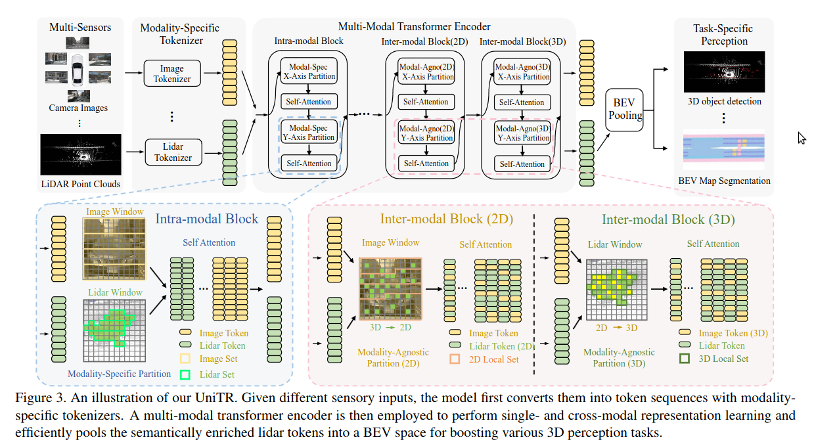
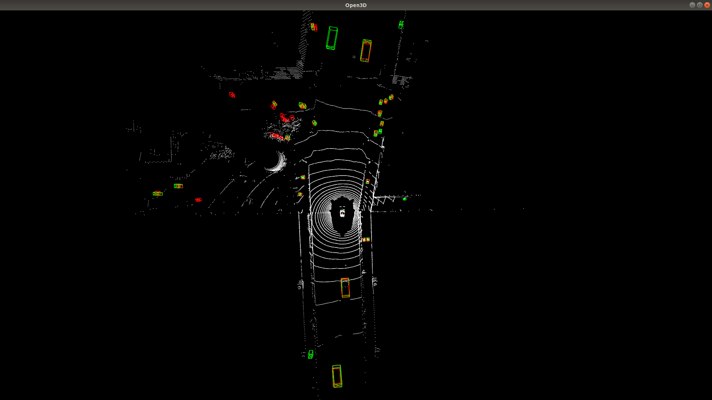
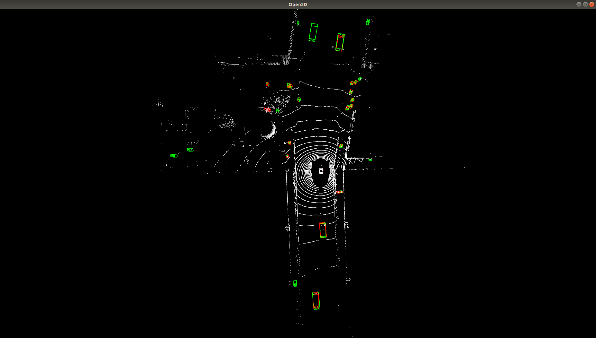

# The analysis of Unitr deployment

by ZhengHu on 4/24/2024

硬件环境：P4000

软件环境：ubuntu18.04、python3.8、pytorch1.31、cuda11.8、TenosrRT8.5

数据集：Nuscenes（6 cameras + 1 lidar）

基于上述环境来分析Unitr模型的部署方案及可行性，本篇分析仅在pytorch上测试，仅供参考。

## 模型框架

## 模块耗时及部署分析

Unitr模型分为下面几个子模块：DynamicVFE、unitr_blocks、pointpillarscatter、baseBEVresBackbone、TransfusionHead、LSS（optional），各子模块耗时统计如下：

| item               | time cost（s） |                                                 |
| ------------------ | -------------- | ----------------------------------------------- |
| DynamicVFE         | 0.005          |                                                 |
| unitr_blocks       | 0.123          | 在没有cache情况耗时0.784s，剩余其他模块变化不大 |
| pointpillarscatter | 0.003          |                                                 |
| baseBEVresBackbone | 0.065          |                                                 |
| TransfusionHead    | 0.087          |                                                 |
| total              | 0.283          |                                                 |

### DynamicVFE

此模块类似VFE，区别是此模块在point层面做全连接，使用scatter_max操作，后续可直接使用VFE替换。

### unitr_blocks

论文中包含四个主要blocks：intra-model block、inter-model block（2D）、inter-model block（2D）、inter-model block（3D），及预处理操作。

| item           | intra-model block | inter-model block（2D） | inter-model block（2D） | inter-model block（3D） |
| -------------- | ----------------- | ----------------------- | ----------------------- | ----------------------- |
| time cost（s） | 0.024             | 0.024                   | 0.024                   | 0.026                   |

上述blocks只包含attention操作，可直接部署TensorRT。优化方面可采用减少block和量化方式，量化可采用PTQ和QAT。

**预处理**主要为三个方面：1激光、图像序列化，2图像到激光的映射，3激光到图像的映射；耗时分别为：0.006、0.005、0.006。

整个模型部署难度主要在数据预处理方面，各种坐标映射关系，set partition的操作，排序操作；针对上述大量逻辑运算，无法在TensorRT上运行，需要编写CUDA代码，编写、调试、运行效率方面成本比较大。

### pointpillarscatter

目前已有cuda操作，可直接应用。

### baseBEVresBackbone

此模块就是基于RPN，基本cnn操作，可直接部署TensorRT，耗时存在优化空间，可参考centerpoint部署的PFN耗时，后续可使用量化操作

### TransfusionHead

此子模块操作比较复杂，是一个二阶段网络，可理解为heatmap+attention操作（具体可参考centerpoint + detr模型），后续的优化空间可使用voxelNext-head或者CenterHead。

综上，部署风险点一方面在激光、图像特征逻辑处理的cuda操作实现，另一方面在量化问题部署及性能指标可控。

# 论文复现

目前复现指标和论文相比相差两个点，分析原因可能是总的batchsize不一致导致，论文中训练batchsize为24，由于显卡限制这边采用batchsize为3。计划后续统一batchsize训练或者尝试加大训练的epochs。

| item     | mAP  | NDS  | visualization                                                |
| -------- | ---- | ---- | ------------------------------------------------------------ |
| own      | 0.68 | 0.71 |  |
| baseline | 0.70 | 0.73 |  |

